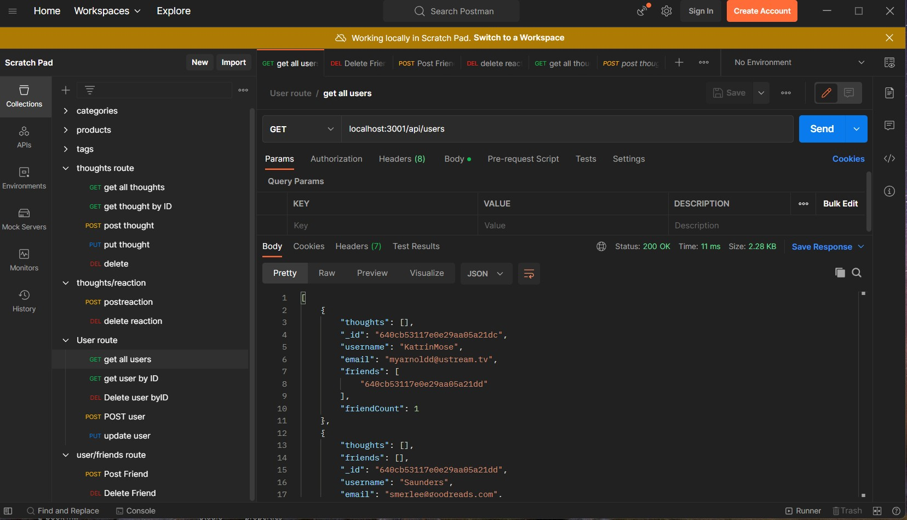

# Social-Network-API
[](https://opensource.org/licenses/MIT) <br>

## Table of Contents

- [Description](#description)
- [Technology](#Technology)
- [Installation](#installation)
- [Usage](#usage)
- [License](#license)
- [Questions](#questions)

## Description:

This project is the concept of Social Network API Where users can make friends, share teir thougths and reaction. 
The app is built on MongoDB and uses Mongoose ODM

## Technology:

Project is built with:


- Node.js
- Express.js
- Javascript
- MongoDB
- Mongoose
- Moment

## Installation

To run this project,  follow next steps:

- Make sure  Mongo DB is installed on your computer
- npm init
- npm install express
- npm install mongoose
- npm install moment

## Usage

After installation  run  node utils/seed to seed database before get it tested

Then run node server.js or 

```
npm start
```

## Walkthrough Video

[ Users Walkthrough Video!](https://youtu.be/V0fyEOfD00Q)
--------
[ Friends Walkthrough Video!](https://youtu.be/I3fv0yknUEg)
--------
[ Thougths Walkthrough Video!](https://youtu.be/Ym6FCgllQrM)
--------
[ Reactions Walkthrough Video!](https://youtu.be/MAQogcBd06o)
--------
## Postman Screenshot



## License

[](https://opensource.org/licenses/MIT) <br>
This project is licensed under MIT, for more information please visit [this website](https://opensource.org/licenses/MIT)


## Questions

Please feel free to contact me if you need any further information:

- [Email](mailto:felixbor@gmail.com)
- [Github Profile](https://github.com/felixbor)